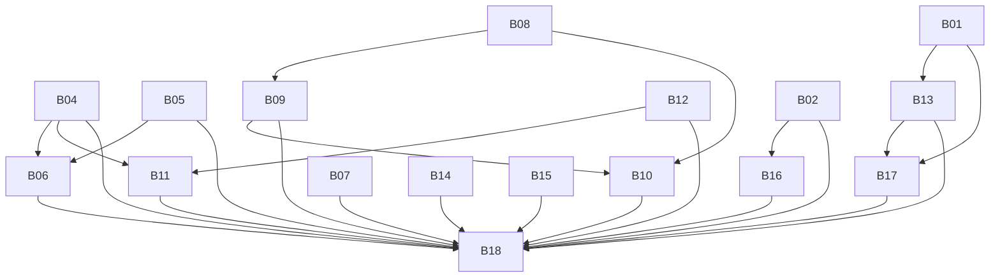

# Backend audit implementation issue drafts — 2026-09-05

**Publication status:** Not published. Automatic approval review blocked the first GitHub tracking-issue creation because the destination repository is public and the audit includes exploitable security evidence. Explicit user approval for public disclosure is required before retrying that action. No GitHub issues were created in this run.

**Destination:** https://github.com/zelengeo/exfil-zone-assistant (public).
**Saved audit:** [BACKEND_AUDIT_2026-09-05.md](BACKEND_AUDIT_2026-09-05.md).
**Scope:** 18 implementation issues plus one audit tracking issue. Existing repository issues were checked; the four existing issues are closed and do not overlap these findings.

The sections below are the exact proposed issue bodies, apart from GitHub numbers and tracking links that can only be filled after creation. Each body contains all eight requested fields. Immutable source references use the verified audit snapshot. A `needs-triage` label identifies issues that include policy/retention or operator decisions; other issues are specified for agent implementation, subject to their blockers.

## Proposed issue index

| Key | Proposed title | Labels | Blocked by |
|---|---|---|---|
| [B01](#b01) | [Critical] Prevent client session updates from changing JWT identity | bug | None — implemented locally; rollout pending |
| [B02](#b02) | [High] Verify OAuth email ownership and resolve linked accounts by provider identity | bug | None — implemented locally; rollout pending |
| [B03](#b03) | [High] Enforce authorization on correction deletion until retirement | bug, ready-for-agent | Superseded by B12 — the vulnerable route was deleted, not gated |
| [B04](#b04) | [High] Repair MongoDB connection lifecycle and remove the unused client pool | bug | None — implemented locally; local replica-set verification pending |
| [B05](#b05) | [High] Connect before creating database sessions in write handlers | bug | None — implemented locally; local replica-set smoke pending |
| [B06](#b06) | [High] Make account deletion atomic and consistent about retained references | bug, needs-triage | None — B04/B05 shipped; implemented locally, historical migration pending |
| [B07](#b07) | [High] Restrict local MongoDB and mongo-express exposure | bug, ready-for-agent | None — already satisfied by commit 1c803be; verified |
| [B08](#b08) | [Medium] Isolate rate-limit policies and preserve their full expiry windows | bug, ready-for-agent | None — implemented locally |
| [B09](#b09) | [Medium] Make rate-limit backend failures explicit and health reporting truthful | bug, needs-triage | B08 |
| [B10](#b10) | [Medium] Cover backend entry points with rate limits and fix quota inspection | bug, ready-for-agent | B08, B09 |
| [B11](#b11) | [Medium] Make MongoDB index rollout previewable and verification fail reliably | bug, ready-for-agent | B04, B12 |
| [B12](#b12) | [Medium] Retire data-correction submissions across UI, APIs and moderation | enhancement, ready-for-agent | None — implemented locally; collection erasure pending |
| [B13](#b13) | [Medium] Enforce current account status on mutations and session refresh | bug, needs-triage | B01 |
| [B14](#b14) | [Medium] Enforce profile privacy in server responses and shared reads | bug, needs-triage | None |
| [B15](#b15) | [Medium] Return correct API errors for duplicate keys and malformed JSON | bug, ready-for-agent | None |
| [B16](#b16) | [Medium] Stop retaining unused OAuth provider tokens | enhancement, ready-for-agent | B02 |
| [B17](#b17) | [Medium] Unify duplicated profile and admin mutation policies | bug, ready-for-agent | B01, B13 |
| [B18](#b18) | [Medium] Correct backend agent guidance and add an operational runbook | documentation, needs-triage | B02, B04, B05, B06, B07, B09, B10, B11, B12, B13, B14, B15, B16, B17 |

## Dependency graph

Arrows mean prerequisite -> dependent. Related-work links in individual bodies are not blockers.

## B01

**Proposed title:** [Critical] Prevent client session updates from changing JWT identity

**Proposed labels:** bug

**Implementation status:** Implemented locally on 2026-09-05; production deployment and pre-fix session revocation remain pending. Keep the issue open until the fixed deployment uses a rotated `NEXTAUTH_SECRET` and the rollout checks pass.

Part of the backend audit dated 2026-09-05. Audit finding: **B01**. Priority: **Critical**.

### Concrete evidence and affected paths

The update branch refreshes database fields and then executes Object.assign(token, session). NextAuth passes request body data into this callback and re-encodes the returned token. Client data can replace id, roles and isBanned. requireAdmin subsequently queries the overwritten id. Public profile responses expose target IDs.

- [src/app/api/auth/[...nextauth]/route.ts:275](https://github.com/zelengeo/exfil-zone-assistant/blob/9639e01a1cdb4fb32435309eaf68f561e6b4046a/src/app/api/auth/%5B...nextauth%5D/route.ts#L275)
- [src/lib/auth/utils.ts:44](https://github.com/zelengeo/exfil-zone-assistant/blob/9639e01a1cdb4fb32435309eaf68f561e6b4046a/src/lib/auth/utils.ts#L44)
- [src/app/api/user/[username]/route.ts:24](https://github.com/zelengeo/exfil-zone-assistant/blob/9639e01a1cdb4fb32435309eaf68f561e6b4046a/src/app/api/user/%5Busername%5D/route.ts#L24)

Evidence baseline: `9639e01a1cdb4fb32435309eaf68f561e6b4046a`. Recheck the current implementation before editing.

**Audit verification:** Reproduced with the installed NextAuth core session handler, actual application callbacks and requireAdmin, with persistence mocked. The member's identity changed and the admin gate succeeded. No live account was accessed.

### User and technical impact

Any authenticated account can impersonate another account, including an administrator, and reach that account's data and mutations.

### Expected behavior

The authenticated subject is immutable for the lifetime of a session. Authorization attributes and refreshed profile data come only from trusted database reads.

### Scope

Replace the arbitrary merge with explicit server-owned claims; handle a missing user by invalidating the session; add a documented deployment step to revoke previously issued sessions after the fix.

### Explicit non-goals

No OAuth linking redesign, role hierarchy change, UI redesign, or live secret rotation during implementation without deployment authorization.

### Acceptance criteria

- [x] A session update cannot change id, sub, roles, isBanned or other security claims through client input.
- [x] Refresh reads the original authenticated user and cannot grant access to a different account.
- [x] Deleted users cannot retain a valid refreshed identity.
- [x] The rollout records how all pre-fix sessions are invalidated; production revocation remains an explicit deployment operation.

Implemented in:

- `src/app/api/auth/[...nextauth]/route.ts`
- `src/lib/auth/session-update.test.ts`
- `src/app/api/AGENTS.md`
- `.env.example`

### Required tests or verification

- [x] Regression using the real NextAuth session update flow with a normal user and an admin fixture: injected identity does not pass requireAdmin.
- [x] Verify legitimate profile refresh, ban state refresh, missing user, unauthenticated update and malformed payload handling.
- [x] Run the existing test suite, type-check and lint for changed files.

Local verification result: **8 test files, 215 tests passed**; TypeScript and changed-file ESLint passed. The production build compiled and type-checked, then stalled during static generation because the configured development MongoDB SRV was unreachable and the existing B04 reconnect loop kept retrying.

Rollout verification still required:

- Deploy the fixed callback with a rotated production `NEXTAUTH_SECRET`.
- Confirm all pre-fix JWT sessions are rejected and users must sign in again.
- Confirm a normal account cannot pass `requireAdmin` after a session refresh.

Add durable regression tests for changed behavior. Existing passing game-data tests alone do not verify this issue. Any infrastructure verification uses disposable/local resources unless live access and the specific operation are authorized.

### Dependencies on other issues

Blocked by: none. This issue can ship independently.

Related work (not blocking):

- B02 — [High] Verify OAuth email ownership and resolve linked accounts by provider identity
- B13 — [Medium] Enforce current account status on mutations and session refresh
- B17 — [Medium] Unify duplicated profile and admin mutation policies

B-key references will be replaced with GitHub issue numbers during publication. Implementations may be developed in parallel where file overlap permits; do not defer an independent security containment fix for a larger cleanup.

### Audit excerpt and pointer

Local audit: `docs/BACKEND_AUDIT_2026-09-05.md`, section `B01`. A GitHub tracking issue will contain the same audit snapshot after publication.

> Any authenticated account can impersonate another account, including an administrator, and reach that account's data and mutations.

Primary references: [1](https://next-auth.js.org/getting-started/client#updating-the-session)

---

## B02

**Proposed title:** [High] Verify OAuth email ownership and resolve linked accounts by provider identity

**Proposed labels:** bug

**Implementation status:** Implemented locally on 2026-09-05; production deployment, unique-index verification and historical OAuth-link review remain pending. Keep the issue open until those rollout checks are complete.

Part of the backend audit dated 2026-09-05. Audit finding: **B02**. Priority: **High**.

### Concrete evidence and affected paths

signIn finds a User by lowercased email before consulting Account. A missing provider link is created for that user without inspecting profile.verified or profile.email_verified. ADMIN_EMAIL promotion uses the same unchecked email. User creation and account linking use separate writes.

- [src/app/api/auth/[...nextauth]/route.ts:123](https://github.com/zelengeo/exfil-zone-assistant/blob/9639e01a1cdb4fb32435309eaf68f561e6b4046a/src/app/api/auth/%5B...nextauth%5D/route.ts#L123)
- [src/models/Account.ts:34](https://github.com/zelengeo/exfil-zone-assistant/blob/9639e01a1cdb4fb32435309eaf68f561e6b4046a/src/models/Account.ts#L34)
- [src/lib/auth/username.ts:36](https://github.com/zelengeo/exfil-zone-assistant/blob/9639e01a1cdb4fb32435309eaf68f561e6b4046a/src/lib/auth/username.ts#L36)

Evidence baseline: `9639e01a1cdb4fb32435309eaf68f561e6b4046a`. Recheck the current implementation before editing.

**Audit verification:** The actual signIn callback accepted an explicitly unverified Discord profile and linked it to an existing admin fixture. Provider response and database were mocked; no live-provider takeover was attempted.

### User and technical impact

An unverified email claim can be treated as ownership of an existing privileged account. Email changes and concurrent first sign-ins can also misassociate or partially create records.

### Expected behavior

Existing links authenticate by provider plus providerAccountId. A new link based on email is allowed only with an explicitly verified, normalized, nonempty email from a supported provider. Missing or false verification fails closed.

### Scope

Define provider-specific verification, identity lookup and safe linking behavior; preserve legitimate existing links; make first-login/link creation idempotent under concurrent requests and handle uniqueness conflicts; apply the same verified-email requirement to admin bootstrap.

### Explicit non-goals

No new providers, manual account-linking UI, provider-token retention changes, or broad auth-library migration.

### Acceptance criteria

- [x] Verified provider identity remains stable if the provider email changes; it cannot silently move to another User.
- [x] Unverified, missing or malformed email claims cannot link to an existing user or bootstrap an admin.
- [x] An existing link to another user is never reassigned.
- [x] Concurrent sign-ins cannot create conflicting links or leave successful partial registration; database constraints remain authoritative.
- [x] Existing legitimate verified Google/Discord sign-ins continue working.

Implemented in:

- `src/app/api/auth/[...nextauth]/route.ts`
- `src/lib/auth/oauth-profile.ts`
- `src/lib/auth/oauth-sign-in.ts`
- `src/lib/auth/oauth-sign-in.test.ts`
- `src/lib/auth/username.ts`
- `src/app/api/AGENTS.md`

### Required tests or verification

- [x] Provider-profile fixtures for Google email_verified and Discord verified: true, false, absent and missing email.
- [x] Existing link, changed email, cross-provider same verified email, conflicting link and configured admin email cases.
- [x] Equivalent transactional persistence tests for concurrent creation and write failure recovery.

Local verification result: **9 test files, 233 tests passed**; TypeScript and changed-file ESLint passed. No live provider or database was mutated.

Rollout verification still required:

- Verify the deployed unique indexes on User email/username and Account provider identity.
- Review or reset provider links created before verified-email enforcement through a separately authorized, recoverable procedure; current records cannot prove which historical links were legitimate.
- Exercise verified Google and Discord sign-in against the development deployment, including an existing link and a new cross-provider link.

Add durable regression tests for changed behavior. Existing passing game-data tests alone do not verify this issue. Any infrastructure verification uses disposable/local resources unless live access and the specific operation are authorized.

### Dependencies on other issues

Blocked by: none. This issue can ship independently.

Related work (not blocking):

- B01 — [Critical] Prevent client session updates from changing JWT identity
- B11 — [Medium] Make MongoDB index rollout previewable and verification fail reliably
- B15 — [Medium] Return correct API errors for duplicate keys and malformed JSON
- B16 — [Medium] Stop retaining unused OAuth provider tokens

B-key references will be replaced with GitHub issue numbers during publication. Implementations may be developed in parallel where file overlap permits; do not defer an independent security containment fix for a larger cleanup.

### Audit excerpt and pointer

Local audit: `docs/BACKEND_AUDIT_2026-09-05.md`, section `B02`. A GitHub tracking issue will contain the same audit snapshot after publication.

> An unverified email claim can be treated as ownership of an existing privileged account. Email changes and concurrent first sign-ins can also misassociate or partially create records.

Primary references: [1](https://next-auth.js.org/providers/google), [2](https://docs.discord.com/developers/resources/user)

---

## B03

**Proposed title:** [High] Enforce authorization on correction deletion until retirement

**Proposed labels:** bug, ready-for-agent

**Implementation status:** Superseded by B12 on 2026-09-05. The maintainer chose retirement over containment, so `DELETE /api/corrections/[id]` was deleted rather than gated with `requireAdmin`. The vulnerability is closed by the route's absence; no authorization fix was written. Close as superseded, not as fixed.

Part of the backend audit dated 2026-09-05. Audit finding: **B03**. Priority: **High**.

### Concrete evidence and affected paths

DELETE /api/corrections/[id] is described as admin-only, but calls only requireAuth before DataCorrection.findByIdAndDelete(id). It has neither an ownership check nor an admin gate. The separate admin route uses requireAdminOrModerator.

- [src/app/api/corrections/[id]/route.ts:63](https://github.com/zelengeo/exfil-zone-assistant/blob/9639e01a1cdb4fb32435309eaf68f561e6b4046a/src/app/api/corrections/%5Bid%5D/route.ts#L63)
- [src/app/api/admin/corrections/[id]/route.ts:158](https://github.com/zelengeo/exfil-zone-assistant/blob/9639e01a1cdb4fb32435309eaf68f561e6b4046a/src/app/api/admin/corrections/%5Bid%5D/route.ts#L158)

Evidence baseline: `9639e01a1cdb4fb32435309eaf68f561e6b4046a`. Recheck the current implementation before editing.

**Audit verification:** Reproduced by invoking the actual DELETE handler with a normal-user session and a different owner's correction fixture. It returned 200 and executed deletion.

### User and technical impact

A normal signed-in user who knows a correction ID can delete somebody else's submission.

### Expected behavior

The legacy endpoint enforces its documented admin-only permission, or is disabled as part of completed retirement. Endpoint naming and rate-limit policy must never substitute for authorization.

### Scope

Apply requireAdmin to the legacy DELETE endpoint as an independently shippable containment fix. Preserve the explicit moderator policy of the separate admin endpoint unless retirement removes it.

### Explicit non-goals

Do not wait for the retirement project, change all moderation roles, or delete historical records.

### Acceptance criteria

- [n/a] Anonymous callers receive 401; ordinary users and moderators cannot delete through the admin-only legacy endpoint.
- [n/a] Denied calls never execute a delete query.
- [n/a] Authorized deletion, invalid ID and missing-record responses behave consistently.
- [x] If B12 removes this route first, verify route removal and close this issue as superseded with evidence.

**Evidence of removal.** `src/app/api/corrections/route.ts` and `src/app/api/corrections/[id]/route.ts` are deleted. A repository search for `api/corrections` returns nothing outside this audit document, and `npm run build` emits no `/api/corrections` route. The first three criteria are marked n/a because there is no endpoint left to authorize.

### Required tests or verification

- Route regression for ordinary user deleting a different user's correction and their own correction.
- Admin success, anonymous denial, moderator denial, malformed ID and not-found cases.
- Assert the persistence mutation is not called on denied paths.

Add durable regression tests for changed behavior. Existing passing game-data tests alone do not verify this issue. Any infrastructure verification uses disposable/local resources unless live access and the specific operation are authorized.

### Dependencies on other issues

Blocked by: none. This issue can ship independently.

Related work (not blocking):

- B01 — [Critical] Prevent client session updates from changing JWT identity
- B12 — [Medium] Retire data-correction submissions across UI, APIs and moderation

B-key references will be replaced with GitHub issue numbers during publication. Implementations may be developed in parallel where file overlap permits; do not defer an independent security containment fix for a larger cleanup.

### Audit excerpt and pointer

Local audit: `docs/BACKEND_AUDIT_2026-09-05.md`, section `B03`. A GitHub tracking issue will contain the same audit snapshot after publication.

> A normal signed-in user who knows a correction ID can delete somebody else's submission.

---

## B04

**Proposed title:** [High] Repair MongoDB connection lifecycle and remove the unused client pool

**Proposed labels:** bug

**Implementation status:** Implemented locally on 2026-09-05; a disposable local replica-set reconnect check remains pending because the Docker daemon was unavailable. No Atlas connection was attempted.

Part of the backend audit dated 2026-09-05. Audit finding: **B04**. Priority: **High**.

### Concrete evidence and affected paths

connectDB uses isConnecting plus a polling interval that only resolves on readyState 1; a failed initiating connection never rejects concurrent waiters. Every attempt adds connection listeners and production reconnect timers. The module also eagerly connects a separate native MongoClient, although the adapter is commented out and the default clientPromise has no active consumer. Health calculates pool availability from mongoose.connections.length.

- [src/lib/mongodb.ts:35](https://github.com/zelengeo/exfil-zone-assistant/blob/9639e01a1cdb4fb32435309eaf68f561e6b4046a/src/lib/mongodb.ts#L35)
- [src/lib/mongodb.ts:70](https://github.com/zelengeo/exfil-zone-assistant/blob/9639e01a1cdb4fb32435309eaf68f561e6b4046a/src/lib/mongodb.ts#L70)
- [src/app/api/auth/[...nextauth]/route.ts:74](https://github.com/zelengeo/exfil-zone-assistant/blob/9639e01a1cdb4fb32435309eaf68f561e6b4046a/src/app/api/auth/%5B...nextauth%5D/route.ts#L74)
- [src/app/api/admin/health/route.ts:84](https://github.com/zelengeo/exfil-zone-assistant/blob/9639e01a1cdb4fb32435309eaf68f561e6b4046a/src/app/api/admin/health/route.ts#L84)
- [package.json:24](https://github.com/zelengeo/exfil-zone-assistant/blob/9639e01a1cdb4fb32435309eaf68f561e6b4046a/package.json#L24)

Evidence baseline: `9639e01a1cdb4fb32435309eaf68f561e6b4046a`. Recheck the current implementation before editing.

**Audit verification:** A controlled failed connect left the actual connectDB concurrent caller pending with its polling callback alive. Unused-pool and inaccurate-metric findings are source-traced.

### User and technical impact

Database outages strand requests and leak timers/listeners. Every process maintains an unused pool. Reported pool metrics do not measure sockets and can conceal saturation.

### Expected behavior

Each process shares a connection attempt that either resolves or rejects for every caller, permits a subsequent retry, and does not spawn competing reconnect loops. Only required pools are opened; health reports truthful metrics.

### Scope

Use a shared promise with failure reset; register lifecycle listeners once; rely on a deliberate driver reconnect policy; remove unused adapter/client runtime paths and dependencies where no consumer remains; make database health metrics accurate or omit unavailable values.

### Explicit non-goals

No database/ODM migration, guessed pool-size optimization, Atlas configuration changes, or removal of mongodb if operational scripts still use it.

### Acceptance criteria

- [x] Concurrent callers share one attempt and all reject on connection failure; a later call can reconnect.
- [x] Repeated disconnect/retry cycles do not increase event listener or timer counts.
- [x] Explicit shutdown cannot schedule an unintended reconnect.
- [x] Importing the module creates no unused native client or unhandled eager rejection.
- [x] Health does not label Mongoose connection-object counts as socket-pool availability.

Implemented in:

- `src/lib/mongodb.ts`
- `src/lib/mongodb.test.ts`
- `src/app/api/admin/health/route.ts`
- `src/app/api/admin/health/route.test.ts`
- `package.json`
- `package-lock.json`
- `src/lib/AGENTS.md`
- `src/models/AGENTS.md`
- `src/app/admin/AGENTS.md`

### Required tests or verification

- [x] Concurrent success, initial failure, retry, disconnect and deliberate shutdown lifecycle tests using controlled driver events.
- [x] Assert one pool/connection attempt and bounded listeners/timers.
- [x] Verify health response distinguishes unavailable metrics from zero.
- [ ] Exercise a local replica-set reconnect without touching Atlas.

Local verification result: **11 test files, 242 tests passed**; TypeScript and changed-file ESLint passed. The package lock parses successfully, the unused Auth MongoDB adapter and its lockfile subtree were removed, and the native `mongodb` dependency remains for `scripts/test-mongodb-connection.ts`. Docker is installed, but its daemon was not running, so the disposable replica-set check could not be executed. No configured remote database was contacted.

Add durable regression tests for changed behavior. Existing passing game-data tests alone do not verify this issue. Any infrastructure verification uses disposable/local resources unless live access and the specific operation are authorized.

### Dependencies on other issues

Blocked by: none. This issue can ship independently.

Related work (not blocking):

- B05 — [High] Connect before creating database sessions in write handlers
- B06 — [High] Make account deletion atomic and consistent about retained references
- B09 — [Medium] Make rate-limit backend failures explicit and health reporting truthful
- B18 — [Medium] Correct backend agent guidance and add an operational runbook

B-key references will be replaced with GitHub issue numbers during publication. Implementations may be developed in parallel where file overlap permits; do not defer an independent security containment fix for a larger cleanup.

### Audit excerpt and pointer

Local audit: `docs/BACKEND_AUDIT_2026-09-05.md`, section `B04`. A GitHub tracking issue will contain the same audit snapshot after publication.

> Database outages strand requests and leak timers/listeners. Every process maintains an unused pool. Reported pool metrics do not measure sockets and can conceal saturation.

---

## B05

**Proposed title:** [High] Connect before creating database sessions in write handlers

**Proposed labels:** bug

**Implementation status:** Implemented locally on 2026-09-05; a disposable local replica-set smoke test for feedback submission and admin deletion remains pending because the Docker daemon was unavailable. No development-cluster records were created or deleted during automated verification.

Part of the backend audit dated 2026-09-05. Audit finding: **B05**. Priority: **High**.

### Concrete evidence and affected paths

These handlers await mongoose.startSession before connectDB, and session creation sits outside their try/catch. On a fresh process Mongoose buffers startSession while the code that would initiate connection remains unreachable.

- [src/app/api/feedback/route.ts:23](https://github.com/zelengeo/exfil-zone-assistant/blob/9639e01a1cdb4fb32435309eaf68f561e6b4046a/src/app/api/feedback/route.ts#L23)
- [src/app/api/admin/users/[id]/route.ts:68](https://github.com/zelengeo/exfil-zone-assistant/blob/9639e01a1cdb4fb32435309eaf68f561e6b4046a/src/app/api/admin/users/%5Bid%5D/route.ts#L68)
- [src/app/api/admin/corrections/[id]/route.ts:71](https://github.com/zelengeo/exfil-zone-assistant/blob/9639e01a1cdb4fb32435309eaf68f561e6b4046a/src/app/api/admin/corrections/%5Bid%5D/route.ts#L71)

Evidence baseline: `9639e01a1cdb4fb32435309eaf68f561e6b4046a`. Recheck the current implementation before editing.

**Audit verification:** Installed Mongoose startSession on a disconnected instance rejected with its connection-buffering timeout. The route source calls it before initiating connectDB.

### User and technical impact

First feedback submissions, admin deletions and correction reviews can time out or escape the normal API error response on cold starts.

### Expected behavior

Connection and required authorization complete before session creation. Session creation, transaction execution and cleanup have consistent error handling.

### Scope

Correct ordering in every affected retained handler, safely handle partially initialized sessions and only abort active transactions. Remove obsolete correction coverage if B12 has already removed the route.

### Explicit non-goals

No connection-cache redesign, data-retention decision, or changes to the business outcome of these operations.

### Acceptance criteria

- [x] Each retained handler succeeds on a fresh process with a reachable database.
- [x] Connection/startSession failures are translated into the normal API error contract.
- [x] A session is ended exactly once when created; cleanup does not mask the original error.
- [x] Unauthorized requests do not start transactions.

Implemented in:

- `src/app/api/feedback/route.ts`
- `src/app/api/feedback/route.test.ts`
- `src/app/api/admin/users/[id]/route.ts`
- `src/app/api/admin/users/[id]/route.test.ts`
- `src/app/api/admin/corrections/[id]/route.ts`
- `src/app/api/admin/corrections/[id]/route.test.ts`
- `src/app/api/AGENTS.md`

### Required tests or verification

- [x] Cold-start route tests with no pre-existing Mongoose connection.
- [x] Inject connect, startSession, write, commit, abort and end-session failures and assert response and cleanup behavior.
- [ ] Replica-set smoke test for feedback submission and admin deletion.

Local verification result: **14 test files, 261 tests passed**; TypeScript and changed-file ESLint passed. The route tests control the connection boundary and driver session directly, reproducing the cold-start hang before the fix and verifying connection/session ordering, error translation, active-transaction aborts and exactly-once cleanup after the fix. Docker is installed, but its daemon was not running, so the disposable replica-set smoke test could not be executed. No configured remote database was contacted.

Add durable regression tests for changed behavior. Existing passing game-data tests alone do not verify this issue. Any infrastructure verification uses disposable/local resources unless live access and the specific operation are authorized.

### Dependencies on other issues

Blocked by: none. This issue can ship independently.

Related work (not blocking):

- B04 — [High] Repair MongoDB connection lifecycle and remove the unused client pool
- B06 — [High] Make account deletion atomic and consistent about retained references
- B12 — [Medium] Retire data-correction submissions across UI, APIs and moderation

B-key references will be replaced with GitHub issue numbers during publication. Implementations may be developed in parallel where file overlap permits; do not defer an independent security containment fix for a larger cleanup.

### Audit excerpt and pointer

Local audit: `docs/BACKEND_AUDIT_2026-09-05.md`, section `B05`. A GitHub tracking issue will contain the same audit snapshot after publication.

> First feedback submissions, admin deletions and correction reviews can time out or escape the normal API error response on cold starts.

---

## B06

**Proposed title:** [High] Make account deletion atomic and consistent about retained references

**Proposed labels:** bug, needs-triage

**Implementation status:** Implemented locally on 2026-09-05 and verified against the local replica set. The retention policy was triaged with the maintainer on 2026-09-05 and is recorded in `src/app/api/AGENTS.md`. Historical remediation of records written by the pre-fix path has not been executed and is still owed — see the note below the acceptance criteria.

Part of the backend audit dated 2026-09-05. Audit finding: **B06**. Priority: **High**.

### Concrete evidence and affected paths

Self-deletion wraps operations in withTransaction but passes its session to none of the User, Account or Feedback queries. It calls feedback anonymization while adding the deleted username and ID to reviewerNotes. Both deletion paths leave correction/reviewer references outside their cleanup policy. Admin deletion sets isAnonymous, which Feedback does not define.

- [src/app/api/user/route.ts:91](https://github.com/zelengeo/exfil-zone-assistant/blob/9639e01a1cdb4fb32435309eaf68f561e6b4046a/src/app/api/user/route.ts#L91)
- [src/app/api/admin/users/[id]/route.ts:96](https://github.com/zelengeo/exfil-zone-assistant/blob/9639e01a1cdb4fb32435309eaf68f561e6b4046a/src/app/api/admin/users/%5Bid%5D/route.ts#L96)
- [src/models/Feedback.ts:24](https://github.com/zelengeo/exfil-zone-assistant/blob/9639e01a1cdb4fb32435309eaf68f561e6b4046a/src/models/Feedback.ts#L24)
- [src/models/DataCorrection.ts:17](https://github.com/zelengeo/exfil-zone-assistant/blob/9639e01a1cdb4fb32435309eaf68f561e6b4046a/src/models/DataCorrection.ts#L17)

Evidence baseline: `9639e01a1cdb4fb32435309eaf68f561e6b4046a`. Recheck the current implementation before editing.

**Audit verification:** Mocked persistence demonstrated an Account mutation without a session before a later Feedback failure returned 500. The session omission is confirmed by the source and Mongoose transaction semantics.

### User and technical impact

A failed deletion can remove OAuth links but leave the account, and retained records can still identify a supposedly anonymized user. Self-service and admin deletion produce different results.

### Expected behavior

All participating account-deletion writes are in one transaction. Both entry points use the same explicit policy for authored content, reviewer attribution and deleted identities.

### Scope

Share the deletion operation where practical; attach the transaction session to every write/read that participates; inventory User references and implement documented deletion/anonymization behavior. Do not add identifying notes as part of anonymization. Address existing records through a separately reviewable migration plan.

### Explicit non-goals

No bulk production purge, legal-policy invention, unrelated moderation rewrite, or irreversible historical-data migration bundled into route deployment.

### Acceptance criteria

- [x] Injected failure after any mutation rolls back all account-deletion changes.
- [x] Both deletion paths remove OAuth links and the User consistently, and treat retained feedback/correction/reviewer references according to one recorded policy.
- [x] No deleted username or user ID is newly copied into notes by the cleanup operation.
- [x] No writes target schema fields that do not exist.
- [x] Historical remediation and retention decisions are explicit before any migration is executed.

**Retention policy, decided by the maintainer on 2026-09-05.** `User` and `Account` are hard
deleted; there is no soft-delete state anywhere in the app. Authored `Feedback` survives with
`userId` unset, and `reviewerNotes[].addedByUserId` is unset for that account's own notes only.
`DataCorrection` is deliberately left untouched because the retirement (B12) erases the collection
wholesale, so anonymizing those rows would be discarded work. Recorded in
`src/app/api/AGENTS.md` under "Account deletion", with a pointer from `src/models/AGENTS.md`.

**Historical remediation still owed.** No migration was executed. Two classes of pre-fix record may
exist and are the remaining work behind the last unticked criterion:

1. `Feedback.reviewerNotes` entries written by the old self-service path, holding
   `User account deleted - <username>` and the deleted user's id in `addedByUserId`. These are the
   records the fix stops creating but does not clean up.
2. Accounts whose self-service deletion failed partway and left OAuth links removed with the `User`
   row intact — possible under the pre-fix sessionless transaction, not detectable from the code.

Deciding whether to purge or leave these is a retention decision, not an implementation one, and it
belongs with the B12 correction-data erasure — so both live in one script,
`scripts/retire-correction-data.ts` (`npm run db:retire-corrections`).

Class 1 is erased by the script's step 2. Class 2 is deliberately **not** erased: step 3 reports
orphaned `feedbacks.userId` references and users left with no OAuth link, and stops. Unsetting an
orphan or deleting a sign-in-locked user is a judgment call about a real person's data, so the
script surfaces the rows and leaves the decision with the operator.

The script has been exercised end to end against the loopback replica set with seeded fixtures: it
drops the collection, pulls only the identifying notes while leaving genuine moderator notes in
place, does not touch the rows step 3 reports, refuses `--apply` unless `--confirm=<database>` names
the connected database, and is a clean no-op on a second run. It has **not** been run against any
non-local database; that remains an authorized operator action.

### Required tests or verification

- [x] Replica-set integration test that injects a failure after Account deletion and verifies User, Account and Feedback remain unchanged.
- [x] Successful self/admin deletion, missing user, protected admin and repeat request cases.
- [x] Verify authored feedback and reviewer attribution cleanup. Correction records are asserted untouched rather than cleaned, per the recorded policy.

Implemented in:

- `src/lib/auth/account-deletion.ts`
- `src/lib/auth/account-deletion.test.ts`
- `src/lib/auth/account-deletion.integration.test.ts`
- `src/app/api/user/route.ts`
- `src/app/api/user/route.test.ts`
- `src/app/api/admin/users/[id]/route.ts`
- `src/app/api/admin/users/[id]/route.test.ts`
- `src/app/api/AGENTS.md`
- `src/models/AGENTS.md`
- `src/AGENTS.md`
- `AGENTS.md`

Verification note: `npm run verify:local` stops at `npm run lint`, which fails on 10 pre-existing
`react-hooks` errors in frontend components untouched by this change (identical with the branch
stashed). The remaining gates were run directly: 283 tests pass with `MONGODB_URI` on the loopback
replica set — including the 5 replica-set deletion cases — and `npm run build` succeeds.
`npm run validate-data` reports its 54 pre-existing missing-image errors.

Add durable regression tests for changed behavior. Existing passing game-data tests alone do not verify this issue. Any infrastructure verification uses disposable/local resources unless live access and the specific operation are authorized.

### Dependencies on other issues

Blocked by:

- B04 — [High] Repair MongoDB connection lifecycle and remove the unused client pool
- B05 — [High] Connect before creating database sessions in write handlers

Related work (not blocking):

- B01 — [Critical] Prevent client session updates from changing JWT identity
- B12 — [Medium] Retire data-correction submissions across UI, APIs and moderation
- B13 — [Medium] Enforce current account status on mutations and session refresh

B-key references will be replaced with GitHub issue numbers during publication. Implementations may be developed in parallel where file overlap permits; do not defer an independent security containment fix for a larger cleanup.

### Audit excerpt and pointer

Local audit: `docs/BACKEND_AUDIT_2026-09-05.md`, section `B06`. A GitHub tracking issue will contain the same audit snapshot after publication.

> A failed deletion can remove OAuth links but leave the account, and retained records can still identify a supposedly anonymized user. Self-service and admin deletion produce different results.

Primary references: [1](https://mongoosejs.com/docs/8.x/docs/transactions.html)

---

## B07

**Proposed title:** [High] Restrict local MongoDB and mongo-express exposure

**Proposed labels:** bug, ready-for-agent

**Implementation status:** Already satisfied when re-checked on 2026-09-05. Commit `1c803be` ("Setup local mongo") rewrote the local stack after the audit baseline was taken, and it happens to meet every criterion here. No further code change was made; the entry below records the verification rather than an edit.

Part of the backend audit dated 2026-09-05. Audit finding: **B07**. Priority: **High when network-reachable**.

### Concrete evidence and affected paths

Compose maps 27018:27017 and 8081:8081 without a host address, runs MongoDB without authorization and explicitly disables mongo-express basic authentication. init-mongo.js contains unrelated bootstrap definitions but is not mounted. The example URI correctly uses a direct connection to the local replica set.

- [compose.yaml:6](https://github.com/zelengeo/exfil-zone-assistant/blob/9639e01a1cdb4fb32435309eaf68f561e6b4046a/compose.yaml#L6)
- [compose.yaml:33](https://github.com/zelengeo/exfil-zone-assistant/blob/9639e01a1cdb4fb32435309eaf68f561e6b4046a/compose.yaml#L33)
- [init-mongo.js:1](https://github.com/zelengeo/exfil-zone-assistant/blob/9639e01a1cdb4fb32435309eaf68f561e6b4046a/init-mongo.js#L1)
- [.env.example:18](https://github.com/zelengeo/exfil-zone-assistant/blob/9639e01a1cdb4fb32435309eaf68f561e6b4046a/.env.example#L18)

Evidence baseline: `9639e01a1cdb4fb32435309eaf68f561e6b4046a`. Recheck the current implementation before editing.

**Audit verification:** Source/configuration finding. Actual external reachability was not tested.

### User and technical impact

Starting the development stack may expose an unauthenticated database and administration UI on host network interfaces, subject to host firewall and routing.

### Expected behavior

The default development database is accessible only locally; the administration UI starts only when deliberately enabled. Documentation describes the actual replica-set bootstrap and authentication assumptions.

### Scope

Bind published ports to 127.0.0.1, make mongo-express opt-in through a Compose profile, and remove or reconcile unused bootstrap code. Keep a working replica-set development environment and matching example URI.

### Explicit non-goals

No Atlas networking/credentials changes, production deployment design, deleting Docker volumes, or migrating existing local data.

### Acceptance criteria

- [x] Rendered Compose binds published services only to loopback.
- [x] Default compose up does not launch mongo-express; an explicit profile does.
- [x] Replica-set initialization and health checks work on an empty disposable volume and on restart.
- [x] The example URI connects from the host; no claim that the unused init script enables authentication remains.

**Verification performed on 2026-09-05, against the current `compose.yaml`:**

- `docker compose config` renders `host_ip: 127.0.0.1` for both published ports; `netstat` shows the
  real host listener as `127.0.0.1:27018`, not `0.0.0.0:27018`.
- `docker compose config --services` lists only `mongodb`. `mongo-express` appears solely under
  `docker compose --profile tools config --services`, and `docker compose ps` confirms it is not
  running. `npm run db:ui` is the documented way to start it.
- mongo-express now sets `ME_CONFIG_BASICAUTH_ENABLED: "true"` with credentials from
  `MONGO_EXPRESS_USERNAME` / `MONGO_EXPRESS_PASSWORD`, rather than disabling basic auth.
- The replica set initialises through the healthcheck, and `npm run db:prepare:local` — which runs
  bootstrap plus a real transaction check — passes against the running stack.
- `init-mongo.js` no longer exists, so no unused bootstrap file can imply authentication is enabled.

### Required tests or verification

- [x] Inspect docker compose config for bindings, profiles and environment.
- [x] Smoke-test a disposable local stack, replica-set transaction and restart; never delete a pre-existing user volume.
- [x] Verify UI availability only when the profile is enabled and check host-listener bindings.

Close as already-fixed, citing `1c803be`. No pre-existing volume was deleted during verification.

Add durable regression tests for changed behavior. Existing passing game-data tests alone do not verify this issue. Any infrastructure verification uses disposable/local resources unless live access and the specific operation are authorized.

### Dependencies on other issues

Blocked by: none. This issue can ship independently.

Related work (not blocking):

- B18 — [Medium] Correct backend agent guidance and add an operational runbook

B-key references will be replaced with GitHub issue numbers during publication. Implementations may be developed in parallel where file overlap permits; do not defer an independent security containment fix for a larger cleanup.

### Audit excerpt and pointer

Local audit: `docs/BACKEND_AUDIT_2026-09-05.md`, section `B07`. A GitHub tracking issue will contain the same audit snapshot after publication.

> Starting the development stack may expose an unauthenticated database and administration UI on host network interfaces, subject to host firewall and routing.

Primary references: [1](https://docs.docker.com/engine/network/port-publishing/)

---

## B08

**Proposed title:** [Medium] Isolate rate-limit policies and preserve their full expiry windows

**Proposed labels:** bug, ready-for-agent

**Implementation status:** Implemented locally on 2026-09-05. Unblocks B09 and B10.

Part of the backend audit dated 2026-09-05. Audit finding: **B08**. Priority: **Medium**.

### Concrete evidence and affected paths

Both backends key counters by caller and time window without a policy identifier. Same-window read/write limits collide. Memory initializes a shared bucket from the first policy, whereas KV compares one shared count to each cap. Memory cleanup deletes all buckets after one hour, including daily/weekly limits. KV INCR and EXPIRE are separate operations.

- [src/lib/rate-limit/rate-limit-memory.ts:17](https://github.com/zelengeo/exfil-zone-assistant/blob/9639e01a1cdb4fb32435309eaf68f561e6b4046a/src/lib/rate-limit/rate-limit-memory.ts#L17)
- [src/lib/rate-limit/rate-limit-memory.ts:57](https://github.com/zelengeo/exfil-zone-assistant/blob/9639e01a1cdb4fb32435309eaf68f561e6b4046a/src/lib/rate-limit/rate-limit-memory.ts#L57)
- [src/lib/rate-limit/rate-limit-kv.ts:5](https://github.com/zelengeo/exfil-zone-assistant/blob/9639e01a1cdb4fb32435309eaf68f561e6b4046a/src/lib/rate-limit/rate-limit-kv.ts#L5)
- [src/lib/middleware.ts:28](https://github.com/zelengeo/exfil-zone-assistant/blob/9639e01a1cdb4fb32435309eaf68f561e6b4046a/src/lib/middleware.ts#L28)
- [src/app/api/user/update-username/route.ts:14](https://github.com/zelengeo/exfil-zone-assistant/blob/9639e01a1cdb4fb32435309eaf68f561e6b4046a/src/app/api/user/update-username/route.ts#L14)

Evidence baseline: `9639e01a1cdb4fb32435309eaf68f561e6b4046a`. Recheck the current implementation before editing.

**Audit verification:** Reproduced 59 writes after one 60/hour read in memory; 30 reads exhausted a 30/hour write allowance in KV; hourly memory cleanup reset a weekly quota.

### User and technical impact

Reads can either inflate or exhaust a write allowance depending on backend. Weekly/daily restrictions can reset after an hour. Interrupted expiry setup can leave stale KV keys.

### Expected behavior

Counters have explicit stable policy namespaces, identical admission semantics across backends, and expiry no earlier than the configured window. Counter creation/increment and expiry are reliable under concurrency and failure.

### Scope

Define a policy ID in the limiter interface; namespace by policy and caller; align backend behavior; store actual expiry for memory cleanup; make KV increment/expiry atomic or equivalently recoverable. Preserve existing nominal caps and fixed-window semantics in this issue.

### Explicit non-goals

No arbitrary limit changes, rolling seven-day username cooldown, production outage-policy change, or UI redesign. A rolling cooldown is a separate product decision.

### Acceptance criteria

- [x] A 60/hour read policy cannot change a 30/hour write policy for the same user.
- [x] One policy behaves identically on memory and KV at boundaries and concurrent calls.
- [x] Daily/weekly buckets survive hourly cleanup and expire when intended.
- [x] KV keys always acquire the intended expiry, including interruption/retry cases.
- [x] Policy naming documents any deliberately shared allowance.

**What changed.** `RateLimiter.check` now takes `(policy, identifier, config)`. Keys are
`rl:<policy>:<caller>:<window>`, built by `resolveWindow` in `rate-limit.ts` — one function both
backends call, so they cannot drift. Both admit identically: increment, then compare the running
count to the cap passed on *this* call, rather than to a cap captured when the counter was created.

Memory stores each counter's own `expiresAt` and cleans up against that, replacing the fixed
one-hour cutoff that silently reset the daily and weekly policies. KV issues INCR and EXPIRE in a
single pipeline, with a TTL of the time remaining in the window: one round trip instead of two, the
TTL can never be missing, re-setting it never extends a counter past its window, and a legacy key
that lost its expiry is repaired on next use.

`withRateLimit` no longer accepts an inline config object — a counter needs a stable name to be
namespaced by. The two inline configs became named policies (`usernameUpdate`, `usernameCheck`), and
the admin health probe got its own (`healthCheck`) so it cannot consume a real allowance. Caps and
fixed-window semantics are unchanged, including the weekly username cooldown, which stays a
fixed window rather than becoming rolling.

**Dead code removed while changing the signature.** The middleware tried to substitute a stricter
policy for anonymous callers by rewriting `Authenticated` to `Anonymous` in the policy name. No
policy is named `*Anonymous` — the configs use `Unauthenticated` — so the lookup always failed and
fell through to the authenticated config. Routes that need this already pass the right policy
themselves, as `feedback` does, so the substitution is gone rather than repaired.

### How it was verified

`src/lib/rate-limit/rate-limit.test.ts`, 14 cases, run against both backends through
`describe.each` with a fake KV pipeline:

- Policy isolation: exhausting the 60/hour read policy leaves the 30/hour write policy untouched
  for the same caller, on memory and on KV.
- Boundary admission: exactly the cap succeeds, the next call is refused, `remaining` and
  `retryAfter` match, and the next window starts a fresh allowance.
- A weekly counter survives two hours of scheduled cleanups.
- KV sets an expiry on every call, never longer than the window, and fails open when unavailable.

Both regressions were confirmed to be caught rather than assumed: removing the policy from the key
fails 3 cases including both backends' isolation test, and restoring the original
"delete anything created over an hour ago" cleanup fails the weekly-counter case. Both sabotages
were reverted.

Implemented in:

- `src/lib/rate-limit/rate-limit.ts`
- `src/lib/rate-limit/rate-limit-memory.ts`
- `src/lib/rate-limit/rate-limit-kv.ts`
- `src/lib/rate-limit/rate-limit.test.ts`
- `src/lib/middleware.ts`
- `src/app/api/user/update-username/route.ts`, `src/app/api/user/check-username/route.ts`
- `src/app/api/admin/health/route.ts`, `src/app/api/rate-limit/status/route.ts`
- `src/lib/AGENTS.md`

Verification: 294 tests pass, `npm run type-check` and `npm run build` are clean, lint holds at its
10 pre-existing problems.

**Left for B10.** `/api/rate-limit/status` still consumes a token from a parallel `:check` counter
and reports that counter's remaining rather than the caller's real allowance. Namespacing keeps it
out of the real buckets; turning it into a true read needs a `peek` on the limiter interface, which
is B10's scope. The route carries a `FIXME (audit B10)` saying so.

### Required tests or verification

- [x] Fake-clock parity suite covering read/write separation, same-interval different caps, 24-hour and 7-day cleanup, boundary/reset and retry headers.
- [ ] Concurrent KV checks against a disposable Redis-compatible instance. Not run: no Redis-compatible instance is provisioned for this repo, and the KV backend is unreachable in development by design. Covered instead by a fake pipeline asserting the single-round-trip INCR+EXPIRE contract.
- [x] Failure between increment and expiry, and repeated retries, cannot create unbounded stale keys. The two operations are now one pipeline, and the TTL is re-set on every call, so a key cannot outlive its window even if an earlier call was interrupted.

Add durable regression tests for changed behavior. Existing passing game-data tests alone do not verify this issue. Any infrastructure verification uses disposable/local resources unless live access and the specific operation are authorized.

### Dependencies on other issues

Blocked by: none. This issue can ship independently.

Related work (not blocking):

- B09 — [Medium] Make rate-limit backend failures explicit and health reporting truthful
- B10 — [Medium] Cover backend entry points with rate limits and fix quota inspection

B-key references will be replaced with GitHub issue numbers during publication. Implementations may be developed in parallel where file overlap permits; do not defer an independent security containment fix for a larger cleanup.

### Audit excerpt and pointer

Local audit: `docs/BACKEND_AUDIT_2026-09-05.md`, section `B08`. A GitHub tracking issue will contain the same audit snapshot after publication.

> Reads can either inflate or exhaust a write allowance depending on backend. Weekly/daily restrictions can reset after an hour. Interrupted expiry setup can leave stale KV keys.

---

## B09

**Proposed title:** [Medium] Make rate-limit backend failures explicit and health reporting truthful

**Proposed labels:** bug, needs-triage

Part of the backend audit dated 2026-09-05. Audit finding: **B09**. Priority: **Medium**.

### Concrete evidence and affected paths

Production silently falls back to process-local memory when either KV variable is absent. KV exceptions return success:true. checkRateLimiterHealth tests the returned object's truthiness, so this fail-open result is reported as operational.

- [src/lib/rate-limit/rate-limit-factory.ts:7](https://github.com/zelengeo/exfil-zone-assistant/blob/9639e01a1cdb4fb32435309eaf68f561e6b4046a/src/lib/rate-limit/rate-limit-factory.ts#L7)
- [src/lib/rate-limit/rate-limit-kv.ts:28](https://github.com/zelengeo/exfil-zone-assistant/blob/9639e01a1cdb4fb32435309eaf68f561e6b4046a/src/lib/rate-limit/rate-limit-kv.ts#L28)
- [src/app/api/admin/health/route.ts:133](https://github.com/zelengeo/exfil-zone-assistant/blob/9639e01a1cdb4fb32435309eaf68f561e6b4046a/src/app/api/admin/health/route.ts#L133)
- [.env.example:29](https://github.com/zelengeo/exfil-zone-assistant/blob/9639e01a1cdb4fb32435309eaf68f561e6b4046a/.env.example#L29)

Evidence baseline: `9639e01a1cdb4fb32435309eaf68f561e6b4046a`. Recheck the current implementation before editing.

**Audit verification:** Actual KV limiter code returned success:true on a mocked KV exception. The health route source treats that result object as operational.

### User and technical impact

Multi-instance deployments can lose effective abuse protection or allow every request during an outage while the health view remains green.

### Expected behavior

Production backend selection and outage behavior are explicit. The caller can distinguish an admitted request, a rejected quota and a failed backend. Health probes independently report real backend availability.

### Scope

Require distributed limiter configuration in production; keep memory an explicit development/test backend. For protected API writes/auth, return a controlled 503 with retry guidance when the backend is unavailable. Make health probe real KV connectivity and distinguish misconfiguration/degraded/error. Document the policy.

### Explicit non-goals

No infrastructure purchase, KV credential rotation, quota redesign, or fallback that claims distributed guarantees while using local memory.

### Acceptance criteria

- [ ] Missing/partial production KV configuration is reported as an error rather than silent healthy memory mode.
- [ ] KV timeouts/errors do not admit protected writes and are not represented as quota-exceeded 429.
- [ ] Backend failures yield consistent controlled responses and bounded waits.
- [ ] Health reports an outage/misconfiguration even when the normal limiter cannot operate; healthy probes do not consume user quotas.

### Required tests or verification

- Production env matrix: absent, partial and complete KV configuration; development/test memory selection.
- Mock KV timeout, auth error and transport failure; assert 503 and degraded/error health.
- Recovery to healthy behavior after backend recovery without misreporting policy denials as infrastructure errors.

Add durable regression tests for changed behavior. Existing passing game-data tests alone do not verify this issue. Any infrastructure verification uses disposable/local resources unless live access and the specific operation are authorized.

### Dependencies on other issues

Blocked by:

- B08 — [Medium] Isolate rate-limit policies and preserve their full expiry windows

Related work (not blocking):

- B04 — [High] Repair MongoDB connection lifecycle and remove the unused client pool
- B10 — [Medium] Cover backend entry points with rate limits and fix quota inspection
- B18 — [Medium] Correct backend agent guidance and add an operational runbook

B-key references will be replaced with GitHub issue numbers during publication. Implementations may be developed in parallel where file overlap permits; do not defer an independent security containment fix for a larger cleanup.

### Audit excerpt and pointer

Local audit: `docs/BACKEND_AUDIT_2026-09-05.md`, section `B09`. A GitHub tracking issue will contain the same audit snapshot after publication.

> Multi-instance deployments can lose effective abuse protection or allow every request during an outage while the health view remains green.

---

## B10

**Proposed title:** [Medium] Cover backend entry points with rate limits and fix quota inspection

**Proposed labels:** bug, ready-for-agent

Part of the backend audit dated 2026-09-05. Audit finding: **B10**. Priority: **Medium**.

### Concrete evidence and affected paths

NextAuth handlers and DELETE /api/user do not call withRateLimit. Exported admin server actions have no limiter and claim to be internal-only. GET /api/rate-limit/status is unthrottled and calls check seven times on separate :check keys, mutating unrelated counters rather than reading actual allowances. The anonymous-policy fallback substitutes Anonymous although the configured suffix is Unauthenticated. IP extraction ignores its request argument and trusts forwarding headers without a documented proxy contract.

- [src/app/api/auth/[...nextauth]/route.ts:335](https://github.com/zelengeo/exfil-zone-assistant/blob/9639e01a1cdb4fb32435309eaf68f561e6b4046a/src/app/api/auth/%5B...nextauth%5D/route.ts#L335)
- [src/app/api/user/route.ts:81](https://github.com/zelengeo/exfil-zone-assistant/blob/9639e01a1cdb4fb32435309eaf68f561e6b4046a/src/app/api/user/route.ts#L81)
- [src/app/api/rate-limit/status/route.ts:8](https://github.com/zelengeo/exfil-zone-assistant/blob/9639e01a1cdb4fb32435309eaf68f561e6b4046a/src/app/api/rate-limit/status/route.ts#L8)
- [src/app/admin/users/[id]/edit/actions.ts:23](https://github.com/zelengeo/exfil-zone-assistant/blob/9639e01a1cdb4fb32435309eaf68f561e6b4046a/src/app/admin/users/%5Bid%5D/edit/actions.ts#L23)
- [src/lib/rate-limit/rate-limit.ts:60](https://github.com/zelengeo/exfil-zone-assistant/blob/9639e01a1cdb4fb32435309eaf68f561e6b4046a/src/lib/rate-limit/rate-limit.ts#L60)
- [src/lib/middleware.ts:23](https://github.com/zelengeo/exfil-zone-assistant/blob/9639e01a1cdb4fb32435309eaf68f561e6b4046a/src/lib/middleware.ts#L23)

Evidence baseline: `9639e01a1cdb4fb32435309eaf68f561e6b4046a`. Recheck the current implementation before editing.

**Audit verification:** Source-traced coverage and status-counter behavior. Production ingress header rewriting and any Vercel-side limits were not inspected.

### User and technical impact

Public entry points can bypass the intended protection or amplify backend calls. Displayed remaining quotas are fictional, and anonymous identity handling is not tied to verified deployment behavior.

### Expected behavior

Every retained externally callable backend entry point has an intentional policy. Quota inspection is read-only and reports the actual applicable policy. Anonymous identity comes from a documented trusted ingress contract.

### Scope

Inventory routes, server actions and retained dynamic DB-backed pages; assign shared policy IDs from B08. Protect expensive/auth mutations without breaking OAuth callbacks or ordinary session polling. Replace or remove the unused status endpoint after checking consumers. Correct anonymous fallback and test request identity extraction.

### Explicit non-goals

No global limit on static game-data pages, new CAPTCHA provider, guessed proxy/header security claim, or rate-limit cap changes unrelated to coverage.

### Acceptance criteria

- [ ] Auth initiation/update, account deletion and exported server actions have documented tested protection appropriate to their traffic.
- [ ] The status endpoint is removed if unused, or independently limited and reads real quota state without consuming it.
- [ ] Anonymous/authenticated policy selection refers to existing explicit policies.
- [ ] Forwarded-header trust is documented for the actual host, with safe fallback and normalized identifiers; spoof resistance is verified rather than assumed.
- [ ] Normal OAuth callback, CSRF and session-refresh flows still work.

### Required tests or verification

- Table-driven entry-point coverage tests for anonymous and signed-in traffic.
- OAuth initiation/callback/session polling smoke tests, including burst denial without breaking a normal login.
- Repeated status inspection leaves real counters unchanged.
- Identity extraction cases for trusted proxy, multiple addresses, malformed/missing headers and authenticated users.

Add durable regression tests for changed behavior. Existing passing game-data tests alone do not verify this issue. Any infrastructure verification uses disposable/local resources unless live access and the specific operation are authorized.

### Dependencies on other issues

Blocked by:

- B08 — [Medium] Isolate rate-limit policies and preserve their full expiry windows
- B09 — [Medium] Make rate-limit backend failures explicit and health reporting truthful

Related work (not blocking):

- B01 — [Critical] Prevent client session updates from changing JWT identity
- B17 — [Medium] Unify duplicated profile and admin mutation policies

B-key references will be replaced with GitHub issue numbers during publication. Implementations may be developed in parallel where file overlap permits; do not defer an independent security containment fix for a larger cleanup.

### Audit excerpt and pointer

Local audit: `docs/BACKEND_AUDIT_2026-09-05.md`, section `B10`. A GitHub tracking issue will contain the same audit snapshot after publication.

> Public entry points can bypass the intended protection or amplify backend calls. Displayed remaining quotas are fictional, and anonymous identity handling is not tied to verified deployment behavior.

Primary references: [1](https://nextjs.org/docs/app/guides/data-security)

---

## B11

**Proposed title:** [Medium] Make MongoDB index rollout previewable and verification fail reliably

**Proposed labels:** bug, ready-for-agent

Part of the backend audit dated 2026-09-05. Audit finding: **B11**. Priority: **Medium**.

### Concrete evidence and affected paths

The index script runs global syncIndexes before repeating createIndexes/syncIndexes per model. There is no diff preview or explicit target selection. Per-model failures and missing unique indexes can still reach the completion message. db:test catches connection errors or missing URI without failing its exit status and hardcodes a database name. User declares three overlapping _id-first indexes; the alleged covering index omits selected username. Feedback indexes reviewedBy/reviewedAt, fields absent from its schema. Runtime autoIndex is disabled.

- [scripts/sync-mongodb-indexes.ts:17](https://github.com/zelengeo/exfil-zone-assistant/blob/9639e01a1cdb4fb32435309eaf68f561e6b4046a/scripts/sync-mongodb-indexes.ts#L17)
- [scripts/test-mongodb-connection.ts:7](https://github.com/zelengeo/exfil-zone-assistant/blob/9639e01a1cdb4fb32435309eaf68f561e6b4046a/scripts/test-mongodb-connection.ts#L7)
- [src/models/User.ts:84](https://github.com/zelengeo/exfil-zone-assistant/blob/9639e01a1cdb4fb32435309eaf68f561e6b4046a/src/models/User.ts#L84)
- [src/models/Feedback.ts:45](https://github.com/zelengeo/exfil-zone-assistant/blob/9639e01a1cdb4fb32435309eaf68f561e6b4046a/src/models/Feedback.ts#L45)
- [src/models/Account.ts:34](https://github.com/zelengeo/exfil-zone-assistant/blob/9639e01a1cdb4fb32435309eaf68f561e6b4046a/src/models/Account.ts#L34)
- [src/lib/mongodb.ts:63](https://github.com/zelengeo/exfil-zone-assistant/blob/9639e01a1cdb4fb32435309eaf68f561e6b4046a/src/lib/mongodb.ts#L63)

Evidence baseline: `9639e01a1cdb4fb32435309eaf68f561e6b4046a`. Recheck the current implementation before editing.

**Audit verification:** Source-traced script control flow and index definitions. Production indexes and execution plans were not inspected.

### User and technical impact

An operator can unexpectedly drop indexes or target the wrong database, while automation reports success after failed verification. Unnecessary indexes add write/storage overhead; missing unique constraints threaten account integrity.

### Expected behavior

Index changes are explicit, reviewed, target-specific and verifiable. Read-only preview is the default, destructive changes require an explicit apply mode, and every required verification failure exits nonzero.

### Scope

Add diffIndexes preview, validated target/configuration, a single application pass, and post-apply checks for User email/username and Account provider identity unique constraints. Fix db:test target resolution and exit codes. Review candidate indexes against actual query shapes and explain plans before pruning; retire stale bootstrap definitions.

### Explicit non-goals

No live Atlas index mutation in this implementation, guessed index pruning, database schema rewrite, or destructive production action hidden behind a test command.

### Acceptance criteria

- [ ] Default invocation prints the target without credentials and the create/drop diff without mutation.
- [ ] Explicit apply performs each intended change once and fails on any model error or absent required constraint.
- [ ] db:test checks the configured database and fails for missing URI, failed connection or failed checks.
- [ ] Index rationales match existing fields and query projections; removals include explain/query evidence.
- [ ] A new environment has a documented index bootstrap path before traffic is enabled.

### Required tests or verification

- Mock preview/apply tests proving preview has zero writes and failures return nonzero.
- Disposable replica-set integration tests for create/drop preview, unique conflicts, partial apply failure and verification.
- Capture representative explain plans using fixtures; no production mutation required.

Add durable regression tests for changed behavior. Existing passing game-data tests alone do not verify this issue. Any infrastructure verification uses disposable/local resources unless live access and the specific operation are authorized.

### Dependencies on other issues

Blocked by:

- B04 — [High] Repair MongoDB connection lifecycle and remove the unused client pool
- B12 — [Medium] Retire data-correction submissions across UI, APIs and moderation

Related work (not blocking):

- B02 — [High] Verify OAuth email ownership and resolve linked accounts by provider identity
- B15 — [Medium] Return correct API errors for duplicate keys and malformed JSON
- B18 — [Medium] Correct backend agent guidance and add an operational runbook

B-key references will be replaced with GitHub issue numbers during publication. Implementations may be developed in parallel where file overlap permits; do not defer an independent security containment fix for a larger cleanup.

### Audit excerpt and pointer

Local audit: `docs/BACKEND_AUDIT_2026-09-05.md`, section `B11`. A GitHub tracking issue will contain the same audit snapshot after publication.

> An operator can unexpectedly drop indexes or target the wrong database, while automation reports success after failed verification. Unnecessary indexes add write/storage overhead; missing unique constraints threaten account integrity.

Primary references: [1](https://mongoosejs.com/docs/8.x/docs/api/model.html#Model.diffIndexes()), [2](https://mongoosejs.com/docs/8.x/docs/api/model.html#Model.syncIndexes())

---

## B12

**Proposed title:** [Medium] Retire data-correction submissions across UI, APIs and moderation

**Proposed labels:** enhancement, ready-for-agent

**Implementation status:** Implemented locally on 2026-09-05. Code, routes, model and UI are removed; the `datacorrections` collection itself is untouched and its erasure remains an explicit operator step — see the note below the acceptance criteria.

Part of the backend audit dated 2026-09-05. Audit finding: **B12**. Priority: **Medium**.

### Concrete evidence and affected paths

Item detail pages still render ItemCorrectionFormAuth. Dedicated submit/read/delete/review APIs, admin pages, DataCorrection schemas/model and contribution statistics remain. The general feedback API still accepts data_correction even though its UI only offers bug, feature and general feedback.

- [src/app/items/[id]/page.tsx:192](https://github.com/zelengeo/exfil-zone-assistant/blob/9639e01a1cdb4fb32435309eaf68f561e6b4046a/src/app/items/%5Bid%5D/page.tsx#L192)
- [src/components/corrections/ItemCorrectionForm.tsx:132](https://github.com/zelengeo/exfil-zone-assistant/blob/9639e01a1cdb4fb32435309eaf68f561e6b4046a/src/components/corrections/ItemCorrectionForm.tsx#L132)
- [src/app/api/corrections/route.ts:81](https://github.com/zelengeo/exfil-zone-assistant/blob/9639e01a1cdb4fb32435309eaf68f561e6b4046a/src/app/api/corrections/route.ts#L81)
- [src/app/api/feedback/route.ts:31](https://github.com/zelengeo/exfil-zone-assistant/blob/9639e01a1cdb4fb32435309eaf68f561e6b4046a/src/app/api/feedback/route.ts#L31)
- [src/lib/schemas/feedback.ts:6](https://github.com/zelengeo/exfil-zone-assistant/blob/9639e01a1cdb4fb32435309eaf68f561e6b4046a/src/lib/schemas/feedback.ts#L6)
- [src/models/DataCorrection.ts:5](https://github.com/zelengeo/exfil-zone-assistant/blob/9639e01a1cdb4fb32435309eaf68f561e6b4046a/src/models/DataCorrection.ts#L5)
- [src/app/dashboard/page.tsx:226](https://github.com/zelengeo/exfil-zone-assistant/blob/9639e01a1cdb4fb32435309eaf68f561e6b4046a/src/app/dashboard/page.tsx#L226)
- [src/app/admin/AGENTS.md:5](https://github.com/zelengeo/exfil-zone-assistant/blob/9639e01a1cdb4fb32435309eaf68f561e6b4046a/src/app/admin/AGENTS.md#L5)

Evidence baseline: `9639e01a1cdb4fb32435309eaf68f561e6b4046a`. Recheck the current implementation before editing.

**Audit verification:** Source-traced active rendering at item page line 192 and active routes/model. Product retirement is explicitly requested by the user.

### User and technical impact

Players can submit unwanted data, maintainers retain an obsolete moderation workload, and a retired capability continues exposing vulnerable server routes and stale domain concepts.

### Expected behavior

Data suggestions cannot be submitted through any UI or API. Ordinary bug reports, feature requests and general feedback continue working. Historical records are preserved until an explicit retention/migration decision.

### Scope

Remove item correction UI, correction routes and admin pages/navigation, active correction schemas/model imports and obsolete stats/reward presentation. Reject data_correction on new feedback requests while preserving the ability to read historical feedback of that type if retained. Update existing scoped documentation and registration defaults as required.

### Explicit non-goals

No removal of ordinary feedback, all user accounts, unrelated partner/moderator functionality, published game-data editing, or production collection/data deletion.

### Acceptance criteria

- [x] Item pages have no suggestion action or correction form dependency.
- [x] All /api/corrections and /api/admin/corrections methods are absent or explicitly retired, with no remaining database mutations.
- [x] New feedback cannot use data_correction; bug/feature/general feedback still works.
- [x] No active UI invites correction submissions or shows correction-specific rewards/counters.
- [x] Historical-data handling and any later archive/delete migration are recorded separately; removing a model is not treated as deleting a collection.
- [x] Search and build verification find no active imports of retired correction modules or dead navigation.

**Readable but not writable.** `data_correction` stays in the feedback `typeEnum`, which is what the
Mongoose enum and every response schema validate against, so historical rows still parse and render
with their icon. A new `submittableTypeEnum` (`bug`, `feature`, `general`) backs
`feedbackSubmitSchema` alone, so a POST naming the retired type is a 400. Removing the value from
`typeEnum` would break reading every stored row of that type; the scoped docs say so where someone
would otherwise be tempted to tidy it away.

**Collection erasure is prepared, not executed.** Removing `src/models/DataCorrection.ts`
unregisters the model; it does not touch the `datacorrections` collection, which still holds every
historical submission. The maintainer has decided to erase it outright, and
`scripts/retire-correction-data.ts` does that as step 1, alongside the B06 remediation as step 2.

Running it against a live database is deliberately not bundled into this deployment:
`npm run db:retire-corrections` is a dry run, and writing requires
`--apply --confirm=<database>`. Verified against the loopback replica set with seeded fixtures;
never run against production from this branch.

**Incidental fixes made in lines this change already had to touch.** Neither was required by the
retirement, but both were wrong:

- The feedback stats increment built its field name from the type name, producing
  `stats.featuresReported` and `stats.generalsReported`, neither of which `User` declares — strict
  mode dropped them, so only bug reports ever counted. It is now an explicit lookup that maps
  `feature` to the declared `stats.featuresProposed`.
- The `/admin` dashboard "Corrections" card was wired to `User.countDocuments` filtered by the
  `admin` and `moderator` roles — it never counted corrections. It is now a "Staff" card naming what
  it actually queries, rather than being deleted along with a working query.

### Required tests or verification

- [x] Route checks for every retired method, plus general-feedback rejection of data_correction.
- [x] Regression for retained anonymous/general feedback and authenticated feedback.
- [x] Item page, dashboard and admin navigation smoke tests; npm test, type-check, lint and build.
- [x] If B03 has not shipped, removal must explicitly verify that its vulnerable DELETE path is gone.

Removed:

- `src/app/api/corrections/route.ts`, `src/app/api/corrections/[id]/route.ts`
- `src/app/api/admin/corrections/route.ts`, `src/app/api/admin/corrections/[id]/route.ts` (and its test)
- `src/app/admin/corrections/page.tsx`
- `src/components/corrections/ItemCorrectionForm.tsx`
- `src/lib/schemas/dataCorrection.ts`, `src/models/DataCorrection.ts`

Edited: `src/app/items/[id]/page.tsx`, `src/app/admin/components/AdminSidebar.tsx`,
`src/app/admin/page.tsx`, `src/app/admin/feedback/page.tsx`,
`src/app/admin/feedback/components/FeedbackFilters.tsx`, `src/app/dashboard/page.tsx`,
`src/app/user/[username]/page.tsx`, `src/components/profile/ProfileStats.tsx`,
`src/app/api/feedback/route.ts` and its test, `src/app/api/user/[username]/route.ts`,
`src/lib/auth/oauth-sign-in.ts`, `src/lib/schemas/feedback.ts`, `src/lib/schemas/user.ts`,
`src/models/User.ts`, `scripts/bootstrap-local-mongodb.ts`, `scripts/sync-mongodb-indexes.ts`,
and the scoped `AGENTS.md` files for `admin`, `api`, `components`, `lib`, `models`, `tasks` and
`src`.

Verification: 280 tests pass against the loopback replica set, `npm run type-check` and
`npm run build` are clean, and `npm run lint` drops from 11 pre-existing problems to 10 — the
eleventh lived in the deleted admin corrections page. No new lint errors.

Add durable regression tests for changed behavior. Existing passing game-data tests alone do not verify this issue. Any infrastructure verification uses disposable/local resources unless live access and the specific operation are authorized.

### Dependencies on other issues

Blocked by: none. This issue can ship independently.

Related work (not blocking):

- B03 — [High] Enforce authorization on correction deletion until retirement
- B05 — [High] Connect before creating database sessions in write handlers
- B06 — [High] Make account deletion atomic and consistent about retained references
- B11 — [Medium] Make MongoDB index rollout previewable and verification fail reliably
- B18 — [Medium] Correct backend agent guidance and add an operational runbook

B-key references will be replaced with GitHub issue numbers during publication. Implementations may be developed in parallel where file overlap permits; do not defer an independent security containment fix for a larger cleanup.

### Audit excerpt and pointer

Local audit: `docs/BACKEND_AUDIT_2026-09-05.md`, section `B12`. A GitHub tracking issue will contain the same audit snapshot after publication.

> Players can submit unwanted data, maintainers retain an obsolete moderation workload, and a retired capability continues exposing vulnerable server routes and stale domain concepts.

---

## B13

**Proposed title:** [Medium] Enforce current account status on mutations and session refresh

**Proposed labels:** bug, needs-triage

Part of the backend audit dated 2026-09-05. Audit finding: **B13**. Priority: **Medium**.

### Concrete evidence and affected paths

requireAuth checks isBanned only from the JWT. Profile and username mutations and correction submission use this token-only gate. JWT state is refreshed only on sign-in/update, and a missing database row during refresh does not itself invalidate the old token. The session maxAge is 30 days.

- [src/lib/auth/utils.ts:13](https://github.com/zelengeo/exfil-zone-assistant/blob/9639e01a1cdb4fb32435309eaf68f561e6b4046a/src/lib/auth/utils.ts#L13)
- [src/app/api/user/route.ts:40](https://github.com/zelengeo/exfil-zone-assistant/blob/9639e01a1cdb4fb32435309eaf68f561e6b4046a/src/app/api/user/route.ts#L40)
- [src/app/api/user/update/route.ts:19](https://github.com/zelengeo/exfil-zone-assistant/blob/9639e01a1cdb4fb32435309eaf68f561e6b4046a/src/app/api/user/update/route.ts#L19)
- [src/app/api/user/update-username/route.ts:23](https://github.com/zelengeo/exfil-zone-assistant/blob/9639e01a1cdb4fb32435309eaf68f561e6b4046a/src/app/api/user/update-username/route.ts#L23)
- [src/app/api/corrections/route.ts:84](https://github.com/zelengeo/exfil-zone-assistant/blob/9639e01a1cdb4fb32435309eaf68f561e6b4046a/src/app/api/corrections/route.ts#L84)
- [src/app/api/auth/[...nextauth]/route.ts:255](https://github.com/zelengeo/exfil-zone-assistant/blob/9639e01a1cdb4fb32435309eaf68f561e6b4046a/src/app/api/auth/%5B...nextauth%5D/route.ts#L255)

Evidence baseline: `9639e01a1cdb4fb32435309eaf68f561e6b4046a`. Recheck the current implementation before editing.

**Audit verification:** Source-traced stale-token gates; the audit separately demonstrated that client update could also overwrite ban state before B01.

### User and technical impact

A user banned after signing in can keep using token-only write endpoints; deleted accounts may retain apparently valid session state. Administrative state changes do not consistently take effect.

### Expected behavior

Authorization-sensitive operations use current account existence and ban state. Missing accounts invalidate sessions. Any intentional exception, such as self-service deletion for a banned user, is explicit and narrowly scoped.

### Scope

Audit retained write gates, share a fresh-user check and apply it consistently. Define the self-deletion exception explicitly rather than inheriting behavior accidentally. Preserve cheap token-only reads only where they do not authorize a protected action.

### Explicit non-goals

No role hierarchy change, periodic DB query on every static page, new session-storage architecture, or implicit decision that banned users lose account deletion rights.

### Acceptance criteria

- [ ] An account banned after token issuance cannot mutate profile, username, feedback or any retained correction endpoint.
- [ ] Missing users cannot refresh into an apparently valid identity or create orphaned content.
- [ ] Unban behavior and any self-deletion exception are documented and tested.
- [ ] All retained mutation paths use the same current-state rule, including duplicate endpoints.

### Required tests or verification

- Issue token, change database ban state, then exercise each retained mutation without refreshing the client token.
- Deleted user, unban, active user and self-deletion policy cases.
- Regression that forged client isBanned cannot override the authoritative row after B01.

Add durable regression tests for changed behavior. Existing passing game-data tests alone do not verify this issue. Any infrastructure verification uses disposable/local resources unless live access and the specific operation are authorized.

### Dependencies on other issues

Blocked by:

- B01 — [Critical] Prevent client session updates from changing JWT identity

Related work (not blocking):

- B06 — [High] Make account deletion atomic and consistent about retained references
- B12 — [Medium] Retire data-correction submissions across UI, APIs and moderation
- B17 — [Medium] Unify duplicated profile and admin mutation policies

B-key references will be replaced with GitHub issue numbers during publication. Implementations may be developed in parallel where file overlap permits; do not defer an independent security containment fix for a larger cleanup.

### Audit excerpt and pointer

Local audit: `docs/BACKEND_AUDIT_2026-09-05.md`, section `B13`. A GitHub tracking issue will contain the same audit snapshot after publication.

> A user banned after signing in can keep using token-only write endpoints; deleted accounts may retain apparently valid session state. Administrative state changes do not consistently take effect.

---

## B14

**Proposed title:** [Medium] Enforce profile privacy in server responses and shared reads

**Proposed labels:** bug, needs-triage

Part of the backend audit dated 2026-09-05. Audit finding: **B14**. Priority: **Medium**.

### Concrete evidence and affected paths

The public API returns the full selected user when publicProfile is true without applying showContributions, so contribution stats remain visible when disabled. The page hides a contributions section at render time. getUserByUsername separately comments out active/banned filters that the API applies, and private API profiles still return location/headset.

- [src/app/api/user/[username]/route.ts:24](https://github.com/zelengeo/exfil-zone-assistant/blob/9639e01a1cdb4fb32435309eaf68f561e6b4046a/src/app/api/user/%5Busername%5D/route.ts#L24)
- [src/lib/user.ts:6](https://github.com/zelengeo/exfil-zone-assistant/blob/9639e01a1cdb4fb32435309eaf68f561e6b4046a/src/lib/user.ts#L6)
- [src/app/user/[username]/page.tsx:65](https://github.com/zelengeo/exfil-zone-assistant/blob/9639e01a1cdb4fb32435309eaf68f561e6b4046a/src/app/user/%5Busername%5D/page.tsx#L65)
- [src/lib/schemas/user.ts:183](https://github.com/zelengeo/exfil-zone-assistant/blob/9639e01a1cdb4fb32435309eaf68f561e6b4046a/src/lib/schemas/user.ts#L183)

Evidence baseline: `9639e01a1cdb4fb32435309eaf68f561e6b4046a`. Recheck the current implementation before editing.

**Audit verification:** Source-traced missing server enforcement. No live user's profile was fetched.

### User and technical impact

Privacy settings differ across UI and API, and data hidden visually can remain available from a server response. Parallel query paths drift on account visibility.

### Expected behavior

One explicit projection/visibility policy controls public profile data. showContributions=false suppresses contribution data server-side. Private profile exposure and banned/inactive visibility are consistent across readers.

### Scope

Centralize the public profile projection and apply it to API and page reads. Use a positive field allowlist. Keep a minimal private-profile identity stub; omit personal location/headset and contribution data for other viewers. Preserve a separate authorized own-profile view.

### Explicit non-goals

No new privacy UI, changing role semantics, hiding IDs as an authorization fix, or retroactive historical data purge.

### Acceptance criteria

- [ ] Contribution stats/content are omitted or consistently neutralized in public responses when showContributions is false.
- [ ] A private profile exposes only the documented minimal identity fields to other users.
- [ ] API and page use consistent active/banned and visibility rules.
- [ ] Email, account metadata and future model fields cannot leak through a negative projection.
- [ ] Owner views remain authorized and usable.

### Required tests or verification

- API/page matrix for public/private, showContributions on/off, owner/other/anonymous and banned/inactive.
- Response assertions cover absence of personal and contribution fields, not merely hidden UI.
- Add a model-only sensitive fixture field and verify allowlisted responses exclude it.

Add durable regression tests for changed behavior. Existing passing game-data tests alone do not verify this issue. Any infrastructure verification uses disposable/local resources unless live access and the specific operation are authorized.

### Dependencies on other issues

Blocked by: none. This issue can ship independently.

Related work (not blocking):

- B01 — [Critical] Prevent client session updates from changing JWT identity
- B12 — [Medium] Retire data-correction submissions across UI, APIs and moderation
- B13 — [Medium] Enforce current account status on mutations and session refresh

B-key references will be replaced with GitHub issue numbers during publication. Implementations may be developed in parallel where file overlap permits; do not defer an independent security containment fix for a larger cleanup.

### Audit excerpt and pointer

Local audit: `docs/BACKEND_AUDIT_2026-09-05.md`, section `B14`. A GitHub tracking issue will contain the same audit snapshot after publication.

> Privacy settings differ across UI and API, and data hidden visually can remain available from a server response. Parallel query paths drift on account visibility.

---

## B15

**Proposed title:** [Medium] Return correct API errors for duplicate keys and malformed JSON

**Proposed labels:** bug, ready-for-agent

Part of the backend audit dated 2026-09-05. Audit finding: **B15**. Priority: **Medium**.

### Concrete evidence and affected paths

handleError recognizes duplicate keys only inside an instanceof MongooseError branch with name MongoError. The installed driver's duplicate-key error is MongoServerError, so code 11000 falls through to 500. request.json SyntaxError likewise becomes 500.

- [src/lib/errors.ts:140](https://github.com/zelengeo/exfil-zone-assistant/blob/9639e01a1cdb4fb32435309eaf68f561e6b4046a/src/lib/errors.ts#L140)
- [src/app/api/user/update-username/route.ts:35](https://github.com/zelengeo/exfil-zone-assistant/blob/9639e01a1cdb4fb32435309eaf68f561e6b4046a/src/app/api/user/update-username/route.ts#L35)
- [src/app/api/user/route.ts:41](https://github.com/zelengeo/exfil-zone-assistant/blob/9639e01a1cdb4fb32435309eaf68f561e6b4046a/src/app/api/user/route.ts#L41)
- [src/app/api/feedback/route.ts:27](https://github.com/zelengeo/exfil-zone-assistant/blob/9639e01a1cdb4fb32435309eaf68f561e6b4046a/src/app/api/feedback/route.ts#L27)

Evidence baseline: `9639e01a1cdb4fb32435309eaf68f561e6b4046a`. Recheck the current implementation before editing.

**Audit verification:** Actual installed MongoServerError(11000) and JSON SyntaxError both produced HTTP 500 through the existing translator.

### User and technical impact

Expected conflicts and invalid requests are reported as server failures, confusing clients/operators. Uniqueness prechecks cannot prevent races and therefore do not replace correct driver-error handling.

### Expected behavior

Database uniqueness conflicts map to a safe 409 response; malformed request JSON maps to 400; unexpected failures remain 500 without leaking database internals.

### Scope

Recognize supported MongoDB error shapes safely using unknown/type guards, preserve Mongoose validation/cast mapping, and handle JSON parse failures at a deliberate request-body boundary.

### Explicit non-goals

No swallowing arbitrary programming SyntaxErrors as client mistakes, schema validation rewrite, hiding internal failures as success, or removing unique indexes.

### Acceptance criteria

- [ ] Real MongoServerError code 11000 yields the established 409 envelope.
- [ ] Malformed JSON yields the established 400 envelope on affected JSON handlers.
- [ ] Unknown errors still yield 500 and production responses do not expose raw queries, keys or stacks.
- [ ] Concurrent username/email conflicts are handled even when initial availability checks pass.

### Required tests or verification

- Use actual installed MongoServerError, Mongoose ValidationError/CastError and ZodError instances.
- Malformed-body route tests, unknown thrown values and unexpected SyntaxError outside parsing.
- Concurrent uniqueness conflict integration test using a disposable database.

Add durable regression tests for changed behavior. Existing passing game-data tests alone do not verify this issue. Any infrastructure verification uses disposable/local resources unless live access and the specific operation are authorized.

### Dependencies on other issues

Blocked by: none. This issue can ship independently.

Related work (not blocking):

- B02 — [High] Verify OAuth email ownership and resolve linked accounts by provider identity
- B11 — [Medium] Make MongoDB index rollout previewable and verification fail reliably

B-key references will be replaced with GitHub issue numbers during publication. Implementations may be developed in parallel where file overlap permits; do not defer an independent security containment fix for a larger cleanup.

### Audit excerpt and pointer

Local audit: `docs/BACKEND_AUDIT_2026-09-05.md`, section `B15`. A GitHub tracking issue will contain the same audit snapshot after publication.

> Expected conflicts and invalid requests are reported as server failures, confusing clients/operators. Uniqueness prechecks cannot prevent races and therefore do not replace correct driver-error handling.

---

## B16

**Proposed title:** [Medium] Stop retaining unused OAuth provider tokens

**Proposed labels:** enhancement, ready-for-agent

Part of the backend audit dated 2026-09-05. Audit finding: **B16**. Priority: **Medium**.

### Concrete evidence and affected paths

Both account creation paths persist access_token, refresh_token and id_token plus other token metadata. Repository searches found no active consumer of these credentials; the app uses OAuth for sign-in and its adapter is disabled.

- [src/app/api/auth/[...nextauth]/route.ts:174](https://github.com/zelengeo/exfil-zone-assistant/blob/9639e01a1cdb4fb32435309eaf68f561e6b4046a/src/app/api/auth/%5B...nextauth%5D/route.ts#L174)
- [src/app/api/auth/[...nextauth]/route.ts:206](https://github.com/zelengeo/exfil-zone-assistant/blob/9639e01a1cdb4fb32435309eaf68f561e6b4046a/src/app/api/auth/%5B...nextauth%5D/route.ts#L206)
- [src/models/Account.ts:22](https://github.com/zelengeo/exfil-zone-assistant/blob/9639e01a1cdb4fb32435309eaf68f561e6b4046a/src/models/Account.ts#L22)

Evidence baseline: `9639e01a1cdb4fb32435309eaf68f561e6b4046a`. Recheck the current implementation before editing.

**Audit verification:** Source-traced credential writes and repository-wide consumer search. No stored credentials were read.

### User and technical impact

The database holds provider credentials that increase the consequence of database access or a backup leak without serving current application behavior.

### Expected behavior

Account records retain only fields required for sign-in/link identity. Unused provider credentials are not persisted for new logins.

### Scope

Verify token consumers once more, stop writing unused credentials, remove unused schema fields and obsolete declarations where safe. Prepare a target-aware dry-run migration for existing token fields; preserve provider/user linkage and needed metadata.

### Explicit non-goals

No provider account revocation, production database mutation, credentials printed in logs/previews, or deletion of OAuth account links.

### Acceptance criteria

- [ ] New account creation/linking persists no unused access, refresh or ID tokens.
- [ ] Google/Discord login and account association still work.
- [ ] Migration preview reports counts/field names only, never credential values; application requires explicit target/apply.
- [ ] Existing token fields are not assumed deleted merely because the schema changed.
- [ ] Any discovered legitimate consumer is documented before changing its contract.

### Required tests or verification

- Capture persistence payloads for both new-user and existing-user linking paths.
- Schema and migration tests using synthetic token fixtures, including idempotency and preservation of identity fields.
- Login regression after B02 using synthetic provider responses.

Add durable regression tests for changed behavior. Existing passing game-data tests alone do not verify this issue. Any infrastructure verification uses disposable/local resources unless live access and the specific operation are authorized.

### Dependencies on other issues

Blocked by:

- B02 — [High] Verify OAuth email ownership and resolve linked accounts by provider identity

Related work (not blocking):

- B11 — [Medium] Make MongoDB index rollout previewable and verification fail reliably
- B18 — [Medium] Correct backend agent guidance and add an operational runbook

B-key references will be replaced with GitHub issue numbers during publication. Implementations may be developed in parallel where file overlap permits; do not defer an independent security containment fix for a larger cleanup.

### Audit excerpt and pointer

Local audit: `docs/BACKEND_AUDIT_2026-09-05.md`, section `B16`. A GitHub tracking issue will contain the same audit snapshot after publication.

> The database holds provider credentials that increase the consequence of database access or a backup leak without serving current application behavior.

---

## B17

**Proposed title:** [Medium] Unify duplicated profile and admin mutation policies

**Proposed labels:** bug, ready-for-agent

Part of the backend audit dated 2026-09-05. Audit finding: **B17**. Priority: **Medium**.

### Concrete evidence and affected paths

Two profile PATCH routes implement the same mutation with different response shapes. Role-specific admin mutation forbids self-modification and modifying other admins, but generic admin PATCH accepts roles through adminUserUpdateSchema and lacks those guards. The server action prevents only self-role changes. These entry points implement incompatible policies for the same data.

- [src/app/api/user/route.ts:37](https://github.com/zelengeo/exfil-zone-assistant/blob/9639e01a1cdb4fb32435309eaf68f561e6b4046a/src/app/api/user/route.ts#L37)
- [src/app/api/user/update/route.ts:14](https://github.com/zelengeo/exfil-zone-assistant/blob/9639e01a1cdb4fb32435309eaf68f561e6b4046a/src/app/api/user/update/route.ts#L14)
- [src/app/api/admin/users/[id]/route.ts:143](https://github.com/zelengeo/exfil-zone-assistant/blob/9639e01a1cdb4fb32435309eaf68f561e6b4046a/src/app/api/admin/users/%5Bid%5D/route.ts#L143)
- [src/app/api/admin/users/[id]/roles/route.ts:53](https://github.com/zelengeo/exfil-zone-assistant/blob/9639e01a1cdb4fb32435309eaf68f561e6b4046a/src/app/api/admin/users/%5Bid%5D/roles/route.ts#L53)
- [src/app/admin/users/[id]/edit/actions.ts:139](https://github.com/zelengeo/exfil-zone-assistant/blob/9639e01a1cdb4fb32435309eaf68f561e6b4046a/src/app/admin/users/%5Bid%5D/edit/actions.ts#L139)
- [src/lib/schemas/user.ts:130](https://github.com/zelengeo/exfil-zone-assistant/blob/9639e01a1cdb4fb32435309eaf68f561e6b4046a/src/lib/schemas/user.ts#L130)

Evidence baseline: `9639e01a1cdb4fb32435309eaf68f561e6b4046a`. Recheck the current implementation before editing.

**Audit verification:** Source comparison of the three admin write paths and their shared request schema. No live role mutation was performed.

### User and technical impact

An admin can bypass role-management restrictions through another endpoint, and fixes to validation, bans, logging or response behavior can reach only one copy. This is policy bypass by an already privileged user, not independent ordinary-user escalation.

### Expected behavior

A single mutation policy applies regardless of API route or server action. The current dedicated role endpoint's self/admin protections are not bypassable through generic edits.

### Scope

Extract shared profile/admin operations with explicit authorization and validation. Restrict role changes to the dedicated policy or apply its guards everywhere. Keep legacy profile endpoints compatible wrappers until consumer migration is verified; align logging and validator options.

### Explicit non-goals

No invented role hierarchy, changing who can grant admin, new role UI, breaking existing profile clients without migration, or treating server actions as private APIs.

### Acceptance criteria

- [ ] Self-role and other-admin role restrictions hold through every mutation entry point.
- [ ] Generic edits cannot accidentally reset or overwrite roles outside the shared role policy.
- [ ] Profile wrappers call the same validated mutation and preserve documented response compatibility.
- [ ] Database validation and audit logging are consistent across API and server-action paths.
- [ ] Caller inventory is recorded before removing a duplicate endpoint.

### Required tests or verification

- Cross-entry-point tests for ordinary caller, admin, self, another admin and normal target user.
- Profile update parity and response-contract tests for both legacy endpoints.
- Assert the same banned-user policy and role-protection errors across wrappers; normal admin profile edits remain supported.

Add durable regression tests for changed behavior. Existing passing game-data tests alone do not verify this issue. Any infrastructure verification uses disposable/local resources unless live access and the specific operation are authorized.

### Dependencies on other issues

Blocked by:

- B01 — [Critical] Prevent client session updates from changing JWT identity
- B13 — [Medium] Enforce current account status on mutations and session refresh

Related work (not blocking):

- B10 — [Medium] Cover backend entry points with rate limits and fix quota inspection
- B15 — [Medium] Return correct API errors for duplicate keys and malformed JSON

B-key references will be replaced with GitHub issue numbers during publication. Implementations may be developed in parallel where file overlap permits; do not defer an independent security containment fix for a larger cleanup.

### Audit excerpt and pointer

Local audit: `docs/BACKEND_AUDIT_2026-09-05.md`, section `B17`. A GitHub tracking issue will contain the same audit snapshot after publication.

> An admin can bypass role-management restrictions through another endpoint, and fixes to validation, bans, logging or response behavior can reach only one copy. This is policy bypass by an already privileged user, not independent ordinary-user escalation.

---

## B18

**Proposed title:** [Medium] Correct backend agent guidance and add an operational runbook

**Proposed labels:** documentation, needs-triage

Part of the backend audit dated 2026-09-05. Audit finding: **B18**. Priority: **Medium**.

### Concrete evidence and affected paths

Model docs claim five active models and adapter-owned Account/Session collections, but Session.ts is commented out and no adapter runs. API docs describe feedback and check-username as authenticated despite anonymous access, and misstate moderator gates. Guidance claims a covering index that omits a selected field. No backend runbook was found for index deployment, recovery, retention, session revocation or limiter outage behavior.

- [src/models/AGENTS.md:3](https://github.com/zelengeo/exfil-zone-assistant/blob/9639e01a1cdb4fb32435309eaf68f561e6b4046a/src/models/AGENTS.md#L3)
- [src/app/api/AGENTS.md:9](https://github.com/zelengeo/exfil-zone-assistant/blob/9639e01a1cdb4fb32435309eaf68f561e6b4046a/src/app/api/AGENTS.md#L9)
- [src/lib/AGENTS.md:58](https://github.com/zelengeo/exfil-zone-assistant/blob/9639e01a1cdb4fb32435309eaf68f561e6b4046a/src/lib/AGENTS.md#L58)
- [src/app/admin/AGENTS.md:18](https://github.com/zelengeo/exfil-zone-assistant/blob/9639e01a1cdb4fb32435309eaf68f561e6b4046a/src/app/admin/AGENTS.md#L18)
- [AGENTS.md:128](https://github.com/zelengeo/exfil-zone-assistant/blob/9639e01a1cdb4fb32435309eaf68f561e6b4046a/AGENTS.md#L128)
- [.env.example:1](https://github.com/zelengeo/exfil-zone-assistant/blob/9639e01a1cdb4fb32435309eaf68f561e6b4046a/.env.example#L1)

Evidence baseline: `9639e01a1cdb4fb32435309eaf68f561e6b4046a`. Recheck the current implementation before editing.

**Audit verification:** Read root and scoped backend AGENTS files, operational scripts, environment example and docs tree. Production service configuration was not audited.

### User and technical impact

Agents and maintainers can reproduce retired functionality, apply incorrect authorization assumptions or run destructive operational scripts without knowing the target and recovery procedure.

### Expected behavior

Scoped guidance states the implemented contracts and their reasons, and points to tested commands. Operational unknowns remain explicit rather than being documented as verified production facts.

### Scope

Update existing root/lib/models/api/admin AGENTS files after the behavior changes; add one focused backend operations document if needed and link it. Cover env ownership, local replica set, startup/index rollout, backups/restore verification, session revocation, deletion/token retention, proxy trust, rate-limit outage policy and incident verification. Each implementation issue should update its own affected guidance; this issue performs the final cross-layer reconciliation.

### Explicit non-goals

No large documentation mirror of code/package.json, fabricated Atlas backup or permission guarantees, unrelated frontend docs rebuild, actual production changes or secret values in documentation.

### Acceptance criteria

- [ ] All documented models, gates, session strategy, live endpoints and retired features match code and tests.
- [ ] Commands specify target, whether they read/write/drop data and how failure is signalled.
- [ ] Runbook includes rollback/recovery and session revocation steps, plus retention and migration boundaries.
- [ ] Atlas permissions, backups/restore history, deployed indexes, production KV and ingress configuration are marked verified with evidence or explicitly unverified with the required operator check.
- [ ] Every audit finding links to its implementation/verification issue; no finding disappears through documentation edits alone.

### Required tests or verification

- Follow the local setup and index preview steps against a disposable replica set.
- Compare an endpoint/method authorization inventory with documented gates.
- Validate links and commands and review for secrets; test the documented error/recovery paths where possible.
- Production checks require appropriate access; retain explicit unresolved operator checks instead of claiming completion.

Add durable regression tests for changed behavior. Existing passing game-data tests alone do not verify this issue. Any infrastructure verification uses disposable/local resources unless live access and the specific operation are authorized.

### Dependencies on other issues

Blocked by:

- B02 — [High] Verify OAuth email ownership and resolve linked accounts by provider identity
- B04 — [High] Repair MongoDB connection lifecycle and remove the unused client pool
- B05 — [High] Connect before creating database sessions in write handlers
- B06 — [High] Make account deletion atomic and consistent about retained references
- B07 — [High] Restrict local MongoDB and mongo-express exposure
- B09 — [Medium] Make rate-limit backend failures explicit and health reporting truthful
- B10 — [Medium] Cover backend entry points with rate limits and fix quota inspection
- B11 — [Medium] Make MongoDB index rollout previewable and verification fail reliably
- B12 — [Medium] Retire data-correction submissions across UI, APIs and moderation
- B13 — [Medium] Enforce current account status on mutations and session refresh
- B14 — [Medium] Enforce profile privacy in server responses and shared reads
- B15 — [Medium] Return correct API errors for duplicate keys and malformed JSON
- B16 — [Medium] Stop retaining unused OAuth provider tokens
- B17 — [Medium] Unify duplicated profile and admin mutation policies

Related work (not blocking):

- B01 — [Critical] Prevent client session updates from changing JWT identity
- B03 — [High] Enforce authorization on correction deletion until retirement
- B08 — [Medium] Isolate rate-limit policies and preserve their full expiry windows

B-key references will be replaced with GitHub issue numbers during publication. Implementations may be developed in parallel where file overlap permits; do not defer an independent security containment fix for a larger cleanup.

### Audit excerpt and pointer

Local audit: `docs/BACKEND_AUDIT_2026-09-05.md`, section `B18`. A GitHub tracking issue will contain the same audit snapshot after publication.

> Agents and maintainers can reproduce retired functionality, apply incorrect authorization assumptions or run destructive operational scripts without knowing the target and recovery procedure.
